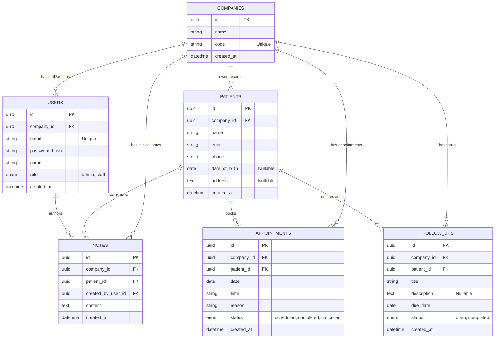

# Database Schema Documentation

This document outlines the data models, fields, types, and relationships within the Clinic Management System's PostgreSQL database.

## Entity Relationship Diagram (ERD)

## Tables Detail

### 1. Companies (`companies`)
The central tenant entity. All other data is scoped to a specific company ID.

| Field | Type | Internal Type | Constraints | Description |
| :--- | :--- | :--- | :--- | :--- |
| `id` | UUID | GUID | PK, Default: `uuid4` | Unique identifier. |
| `name` | String | String | Not Null | Display name of the clinic. |
| `code` | String | String | Unique, Not Null | Unique code for staff verification/login. |
| `created_at` | DateTime | DateTime | Default: `now()` | Timestamp of creation. |

### 2. Users (`users`)
Staff members and administrators with access to the system.

| Field | Type | Internal Type | Constraints | Description |
| :--- | :--- | :--- | :--- | :--- |
| `id` | UUID | GUID | PK | Unique identifier. |
| `company_id` | UUID | GUID | FK (`companies.id`) | Tenant association. |
| `email` | String | String | Unique, Not Null | Login email. |
| `password_hash`| String | String | Not Null | BCrypt hashed password. |
| `name` | String | String | Not Null | Full name of the user. |
| `role` | Enum | UserRole | `admin`, `staff` | RBAC role. |
| `created_at` | DateTime | DateTime | Default: `now()` | Timestamp of registration. |

### 3. Patients (`patients`)
Medical records of individuals visiting the clinic.

| Field | Type | Internal Type | Constraints | Description |
| :--- | :--- | :--- | :--- | :--- |
| `id` | UUID | GUID | PK | Unique identifier. |
| `company_id` | UUID | GUID | FK (`companies.id`) | Tenant association. |
| `name` | String | String | Not Null | Patient's full name. |
| `email` | String | String | Not Null | Contact email. |
| `phone` | String | String | Not Null | Contact phone. |
| `date_of_birth`| Date | Date | Nullable | DOB. |
| `address` | Text | Text | Nullable | Physical address. |
| `created_at` | DateTime | DateTime | Default: `now()` | Record creation time. |

### 4. Appointments (`appointments`)
Scheduled visits between patients and the clinic.

| Field | Type | Internal Type | Constraints | Description |
| :--- | :--- | :--- | :--- | :--- |
| `id` | UUID | GUID | PK | Unique identifier. |
| `company_id` | UUID | GUID | FK (`companies.id`) | Tenant association. |
| `patient_id` | UUID | GUID | FK (`patients.id`) | The patient being seen. |
| `date` | Date | Date | Not Null | Date of appointment. |
| `time` | String | String | Not Null | Time slot (e.g., "14:00"). |
| `reason` | String | String | Not Null | Purpose of visit. |
| `status` | Enum | ApptStatus | `scheduled`, `completed`, `cancelled`| Current state. |
| `created_at` | DateTime | DateTime | Default: `now()` | Booking time. |

### 5. Notes (`notes`)
Clinical observations or general notes about a patient.

| Field | Type | Internal Type | Constraints | Description |
| :--- | :--- | :--- | :--- | :--- |
| `id` | UUID | GUID | PK | Unique identifier. |
| `company_id` | UUID | GUID | FK (`companies.id`) | Tenant association. |
| `patient_id` | UUID | GUID | FK (`patients.id`) | The subject patient. |
| `created_by_...`| UUID | GUID | FK (`users.id`) | Author of the note. |
| `content` | Text | Text | Not Null | The note body. |
| `created_at` | DateTime | DateTime | Default: `now()` | Time recorded. |

### 6. Follow Ups (`follow_ups`)
Action items or tasks related to patient care.

| Field | Type | Internal Type | Constraints | Description |
| :--- | :--- | :--- | :--- | :--- |
| `id` | UUID | GUID | PK | Unique identifier. |
| `company_id` | UUID | GUID | FK (`companies.id`) | Tenant association. |
| `patient_id` | UUID | GUID | FK (`patients.id`) | The subject patient. |
| `title` | String | String | Not Null | Short task summary. |
| `description` | Text | Text | Nullable | Detailed instructions. |
| `due_date` | Date | Date | Not Null | Deadline for the task. |
| `status` | Enum | FollowUpStatus| `open`, `completed` | Task completion status. |
| `created_at` | DateTime | DateTime | Default: `now()` | Task creation time. |
